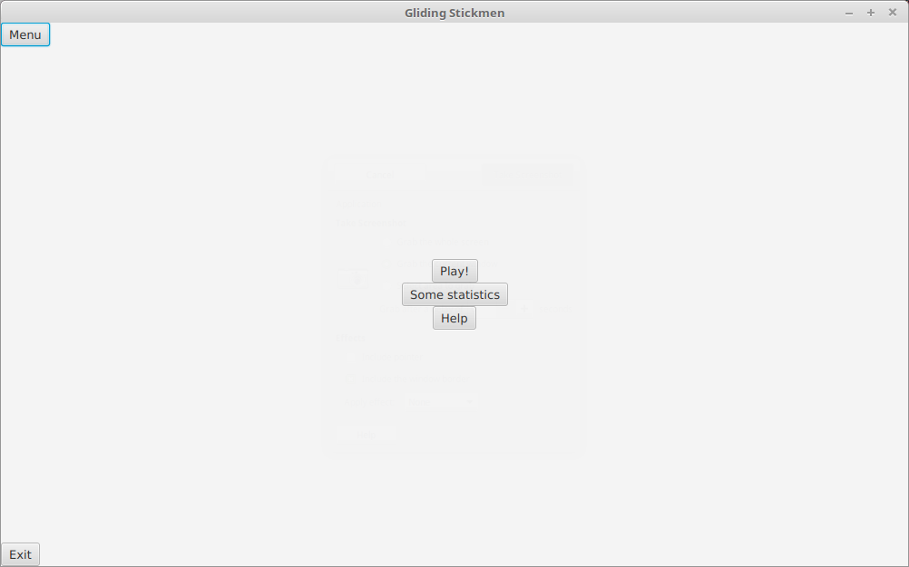
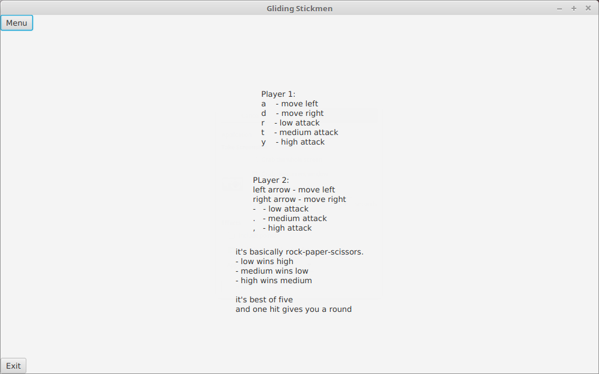
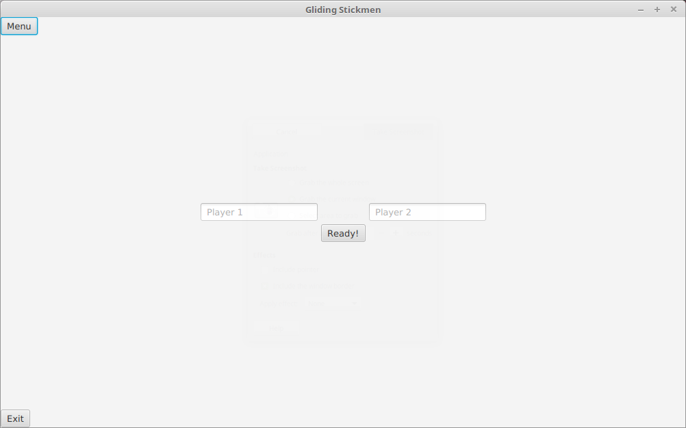

# Käyttöohje
Lataa [GlidingStickmen.jar](https://github.com/Etsku520/otm-harjoitustyo/releases/tag/viikko6)

Toimii ilman mitään konfigurointia tai ainakin pitäisi.

## Ohjelman käynnistäminen
Ohjelma käynnistynee komennolla
		java -jar GlidingStickmen.jar

## Main menu
Ohelman napit:
- menu: Vie aina takaisin alku näkymään
- play: vie kothi pelin pelaamista
- some statistics: Näyttää kymmenen viimeisimmän tappelun tulokset
- help: avaa avustut sivun, jossa kerrotaan kuinka peliä pelataan
- exit: sammuttaa pelin

## Help

## Name select
Ensimmäinen kenttä on ensimmäistä pelaajaan nimeä varten ja toinen kenttä on toista pelaajaan nimeä varten.

Painamalla "Ready!"-nappia peli alkaa

