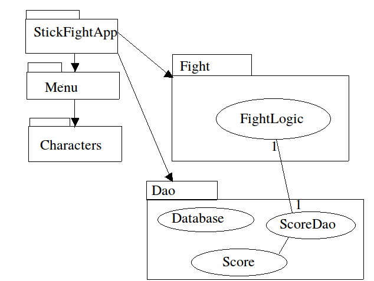
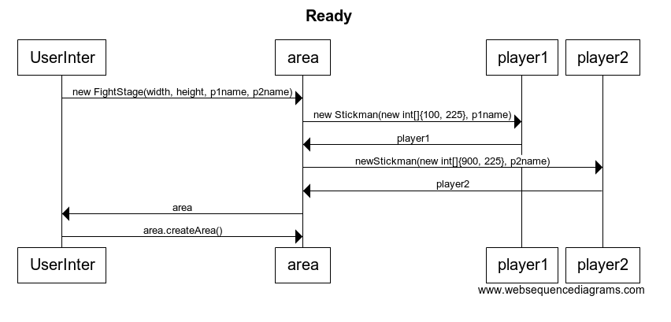

## Pakkauskaavio
Sovelluksen logiikka löytyy FightLogic -luokasta ja tietokantaan osuus Database-, ScoreDao- ja Score-luokissa

FightLogic tarkastaa ja liikuttaa hamoja, tarkkailee osuuko jokin, muuttaa pisteitä ja tarkastaa voittajan

Database -luokka luo yhteyden tietokantaan ja tarvittaessa tekee uuden ja lisää sinne tarvittaavt taulut.

ScoreDao -luokka yhdessä tietokannan taulua vastaavan Score -luokan kanssa lisäävät pisteitä tietokantaan ja lukevat tietoa tietokannasta.

## Sekvenssikaavio

